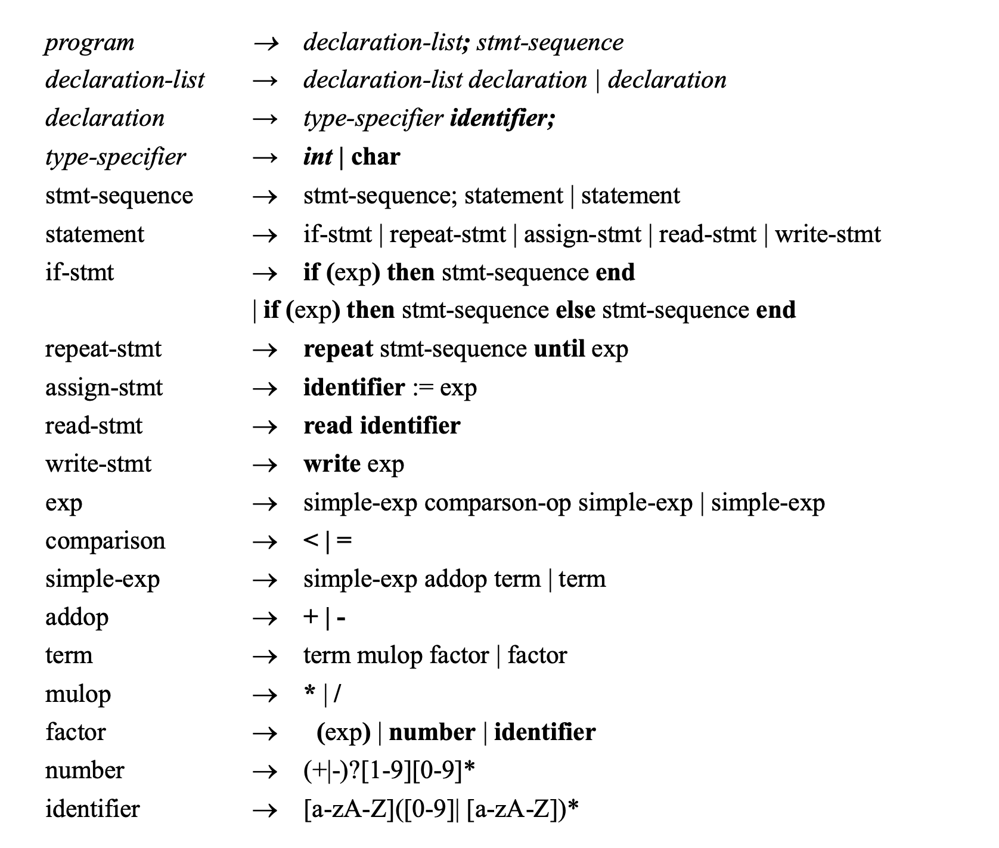
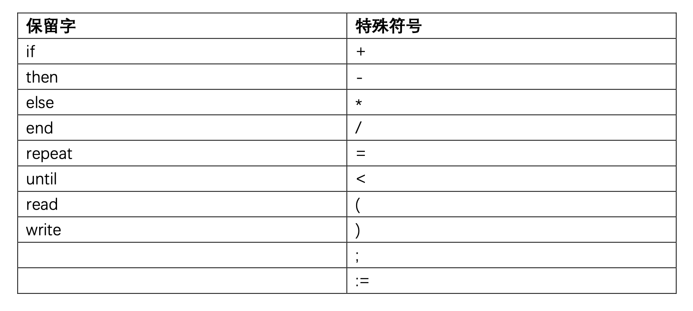

# RusTiny -- A Rust implementation of Tiny+ language

## Installation

Firstly, you need to install rust nightly.

Install rustup with

```
curl --proto '=https' --tlsv1.2 -sSf https://sh.rustup.rs | sh
```

Switch to nightly toolchain with

```
rustup default nightly
```

Build this project with

```
git clone https://github.com/M4tsuri/rustiny.git
cd rustiny
cargo build --release
```

Run with

```
target/release/rustiny --input examples/tmp1.tiny
```


## 编译器实践

### 基本要求:

- 参考《编译原理及实践》的TINY语言编译器(已上传到群中)完成TINY+ 语言(见附录 A)的解释器:即给定满足 TINY+语言的源代码输入，你的解 释器可以给出对其的解释执行结果。
- 基于上一步，完成实验报告(见附录B)。 b. 扩展(可选，即自己决定是否完成):
- 可以在 TINY+上增加更多语言特性(如支持运算的布尔表达式、函数等);
- 可以考虑增加更多编译器功能，如代码优化。

### 提示

- 可以在《编译原理及实践》的源代码上进行修改;
- 可以借用 antlr 等工具辅助完成;
- 可以完全自己编码实现。

## 相关信息

### 文法定义



### 保留字表


